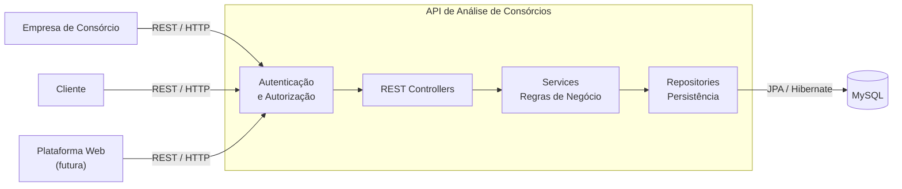
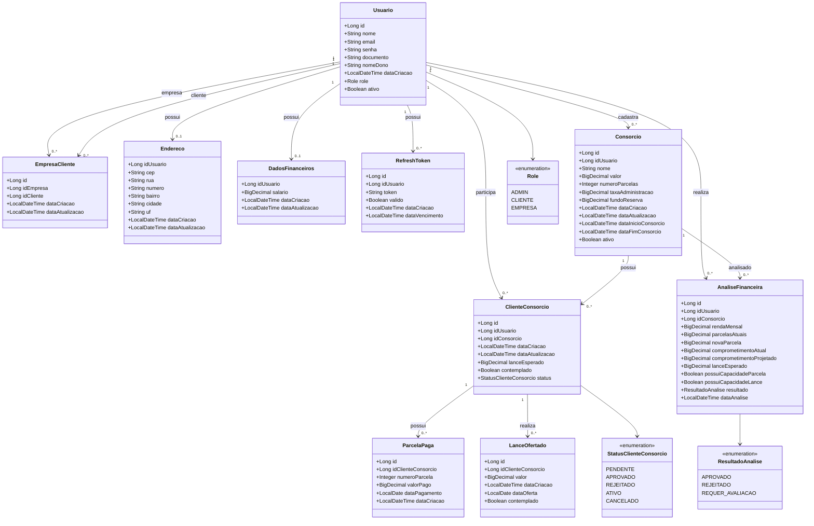

# Diagramas
## arquitetura

```mermaid
flowchart LR

    Empresa["Empresa de Consórcio"]
    Cliente["Cliente"]
    Web["Plataforma Web<br/>(futura)"]

    subgraph API["API de Análise de Consórcios"]
        Security["Autenticação<br/>e Autorização"]

        Controllers["REST Controllers"]

        Services["Services<br/>Regras de Negócio"]

        Repositories["Repositories<br/>Persistência"]
    end

    DB[("MySQL")]

    Empresa -->|"REST / HTTP"| Security
    Cliente -->|"REST / HTTP"| Security
    Web -->|"REST / HTTP"| Security

    Security --> Controllers
    Controllers --> Services
    Services --> Repositories
    Repositories -->|"JPA / Hibernate"| DB
```
## classes

```mermaid
classDiagram

    class Usuario {
        +Long id
        +String nome
        +String email
        +String senha
        +String documento
        +String nomeDono
        +LocalDateTime dataCriacao
        +Role role
        +Boolean ativo
    }

    class EmpresaCliente {
        +Long id
        +Long idEmpresa
        +Long idCliente
        +LocalDateTime dataCriacao
        +LocalDateTime dataAtualizacao
    }

    class Endereco {
        +Long idUsuario
        +String cep
        +String rua
        +String numero
        +String bairro
        +String cidade
        +String uf
        +LocalDateTime dataCriacao
        +LocalDateTime dataAtualizacao
    }

    class DadosFinanceiros {
        +Long idUsuario
        +BigDecimal salario
        +LocalDateTime dataCriacao
        +LocalDateTime dataAtualizacao
    }

    class RefreshToken {
        +Long id
        +Long idUsuario
        +String token
        +Boolean valido
        +LocalDateTime dataCriacao
        +LocalDateTime dataVencimento
    }

    class Consorcio {
        +Long id
        +Long idUsuario
        +String nome
        +BigDecimal valor
        +Integer numeroParcelas
        +BigDecimal taxaAdministracao
        +BigDecimal fundoReserva
        +LocalDateTime dataCriacao
        +LocalDateTime dataAtualizacao
        +LocalDateTime dataInicioConsorcio
        +LocalDateTime dataFimConsorcio
        +Boolean ativo
    }

    class ClienteConsorcio {
        +Long id
        +Long idUsuario
        +Long idConsorcio
        +LocalDateTime dataCriacao
        +LocalDateTime dataAtualizacao
        +BigDecimal lanceEsperado
        +Boolean contemplado
        +StatusClienteConsorcio status
    }

    class ParcelaPaga {
        +Long id
        +Long idClienteConsorcio
        +Integer numeroParcela
        +BigDecimal valorPago
        +LocalDate dataPagamento
        +LocalDateTime dataCriacao
    }

    class LanceOfertado {
        +Long id
        +Long idClienteConsorcio
        +BigDecimal valor
        +LocalDateTime dataCriacao
        +LocalDate dataOferta
        +Boolean contemplado
    }

    class AnaliseFinanceira {
        +Long id
        +Long idUsuario
        +Long idConsorcio
        +BigDecimal rendaMensal
        +BigDecimal parcelasAtuais
        +BigDecimal novaParcela
        +BigDecimal comprometimentoAtual
        +BigDecimal comprometimentoProjetado
        +BigDecimal lanceEsperado
        +Boolean possuiCapacidadeParcela
        +Boolean possuiCapacidadeLance
        +ResultadoAnalise resultado
        +LocalDateTime dataAnalise
    }

    class Role {
        <<enumeration>>
        ADMIN
        CLIENTE
        EMPRESA
    }

    class StatusClienteConsorcio {
        <<enumeration>>
        PENDENTE
        APROVADO
        REJEITADO
        ATIVO
        CANCELADO
    }

    class ResultadoAnalise {
        <<enumeration>>
        APROVADO
        REJEITADO
        REQUER_AVALIACAO
    }


    Usuario "1" --> "0..1" Endereco : possui
    Usuario "1" --> "0..1" DadosFinanceiros : possui
    Usuario "1" --> "0..*" RefreshToken : possui

    Usuario "1" --> "0..*" EmpresaCliente : empresa
    Usuario "1" --> "0..*" EmpresaCliente : cliente

    Usuario "1" --> "0..*" Consorcio : cadastra

    Usuario "1" --> "0..*" ClienteConsorcio : participa
    Consorcio "1" --> "0..*" ClienteConsorcio : possui

    ClienteConsorcio "1" --> "0..*" ParcelaPaga : possui
    ClienteConsorcio "1" --> "0..*" LanceOfertado : realiza

    Usuario "1" --> "0..*" AnaliseFinanceira : realiza
    Consorcio "1" --> "0..*" AnaliseFinanceira : analisado

    Usuario --> Role
    ClienteConsorcio --> StatusClienteConsorcio
    AnaliseFinanceira --> ResultadoAnalise
```
## UML

```mermaid
flowchart LR

    Empresa["👤 Empresa de Consórcio"]
    Cliente["👤 Cliente"]
    Admin["👤 Administrador"]

    subgraph Sistema["Sistema de Análise de Consórcios"]

        UC_Auth(("Autenticar-se"))

        UC_CadastrarCliente(("Cadastrar cliente"))
        UC_AtualizarCliente(("Atualizar dados do cliente"))
        UC_ConsultarCliente(("Consultar cliente"))

        UC_CadastrarConsorcio(("Cadastrar consórcio"))
        UC_AtualizarConsorcio(("Atualizar consórcio"))
        UC_ConsultarConsorcios(("Consultar consórcios"))

        UC_Vincular(("Vincular cliente<br/>à empresa"))

        UC_Associar(("Associar cliente<br/>ao consórcio"))
        UC_ConsultarParticipacao(("Consultar participação<br/>em consórcio"))

        UC_Analise(("Realizar análise<br/>financeira"))
        UC_Historico(("Consultar histórico<br/>de análises"))

        UC_Parcela(("Registrar parcela paga"))

        UC_Lance(("Registrar lance"))
        UC_ConsultarLances(("Consultar lances"))

        UC_Gerenciar(("Gerenciar usuários"))
    end

    Empresa --> UC_Auth
    Empresa --> UC_CadastrarCliente
    Empresa --> UC_AtualizarCliente
    Empresa --> UC_ConsultarCliente
    Empresa --> UC_CadastrarConsorcio
    Empresa --> UC_AtualizarConsorcio
    Empresa --> UC_ConsultarConsorcios
    Empresa --> UC_Vincular
    Empresa --> UC_Associar
    Empresa --> UC_ConsultarParticipacao
    Empresa --> UC_Analise
    Empresa --> UC_Historico
    Empresa --> UC_Parcela
    Empresa --> UC_Lance
    Empresa --> UC_ConsultarLances

    Cliente --> UC_Auth
    Cliente --> UC_AtualizarCliente
    Cliente --> UC_ConsultarCliente
    Cliente --> UC_ConsultarConsorcios
    Cliente --> UC_ConsultarParticipacao
    Cliente --> UC_Analise
    Cliente --> UC_Historico
    Cliente --> UC_ConsultarLances

    Admin --> UC_Auth
    Admin --> UC_Gerenciar
```