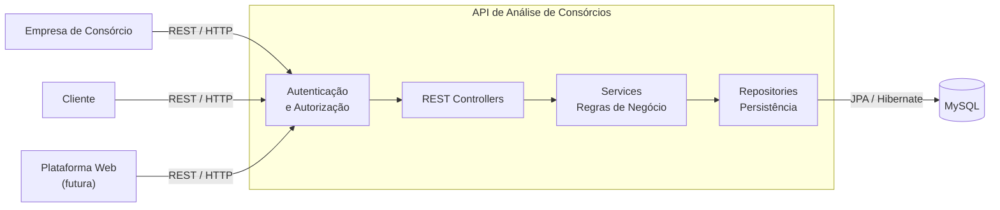

# ConsorCheck

Validador de crédito de usuários para participação em consórcios.

ConsorCheck é uma API construída com Spring Boot que centraliza regras de negócio para análise financeira de potenciais participantes de consórcios, gestão de consórcios, registro de pagamentos e lances. O projeto inclui autenticação (JWT), persistência via JPA/Hibernate e migrações com Flyway.

Principais funcionalidades

- Autenticação e autorização (JWT)
- Gestão de usuários, empresas e clientes
- Cadastro e gerenciamento de consórcios
- Associação de clientes a consórcios
- Registro de parcelas pagas e lances ofertados
- Análises financeiras para verificar capacidade de parcela e lance
- Histórico de análises
- Documentação Swagger disponível

Tecnologias

- Java (definido no pom.xml)
- Spring Boot (Web, Data JPA, Security)
- MySQL (conector MySQL)
- Flyway para migrações de banco de dados
- JJWT para tokens JWT
- Springdoc OpenAPI / Swagger UI
- MapStruct, Lombok (quando aplicável)

Pré-requisitos

- Java (versão compatível com a configuração do projeto)
- Maven 3.6+
- MySQL (ou outro banco compatível configurado via application.properties)

Como rodar localmente

1. Clone o repositório:

   git clone https://github.com/enzoDante/ConsorCheck.git
   cd ConsorCheck

2. Ajuste as configurações do banco de dados em src/main/resources/application.properties (exemplo abaixo):

```
spring.datasource.url=jdbc:mysql://localhost:3306/consorcheck
spring.datasource.username=root
spring.datasource.password=senha
spring.jpa.hibernate.ddl-auto=validate
spring.flyway.enabled=true
spring.flyway.locations=classpath:db/migration
server.port=8080

# JWT
jjwt.secret=troca-essa-chave-por-uma-segura
jjwt.expiration-ms=3600000
```

3. Build e executar com Maven:

   mvn clean package
   mvn spring-boot:run

Ou rode o JAR:

   java -jar target/ConsorCheck-0.0.1-SNAPSHOT.jar

A aplicação por padrão ficará disponível em http://localhost:8080

Documentação da API

A documentação interativa Swagger (OpenAPI) está disponível em:

http://localhost:8080/swagger-ui/index.html

Modelos e entidades principais

- Usuario: informações de login, documento, papel (ROLE)
- EmpresaCliente: vínculo entre empresas e clientes
- Endereco: dados de endereço do usuário
- DadosFinanceiros: renda e dados fiscais
- Consorcio: informações do consórcio (valor, parcelas, taxas)
- ClienteConsorcio: vínculo do cliente com um consórcio (status, lance esperado)
- ParcelaPaga: registro de pagamento de parcela
- LanceOfertado: lances ofertados pelo cliente
- AnaliseFinanceira: resultado das análises de crédito

Migrações e banco

O projeto usa Flyway; inclua os scripts de migração em src/main/resources/db/migration seguindo o padrão V___.sql. Ao iniciar a aplicação, as migrações serão aplicadas automaticamente ao banco configurado.

Testes

Para rodar os testes unitários/integrados:

   mvn test

Boas práticas e segurança

- Nunca commit chave JWT (jjwt.secret) em repositórios públicos. Use variáveis de ambiente ou um cofre de segredos.
- Ajuste políticas de CORS e rate limiting conforme necessidade antes de expor a API.
- Mantenha dependências atualizadas e verifique vulnerabilidades com ferramentas como Dependabot.

Contribuição

1. Abra uma issue para discutir mudanças maiores.
2. Crie uma branch por feature: `git checkout -b feat/minha-nova-funcionalidade`
3. Faça commits pequenos e significativos.
4. Abra um Pull Request apontando a branch de desenvolvimento.

Licença

Adicione aqui a licença do projeto (ex.: MIT, Apache-2.0) ou remova esta seção se não aplicável.

Contato

Em caso de dúvidas, abra uma issue no repositório.

---

## Diagramas

(Abaixo estavam os diagramas do README anterior — mantive-os nesta seção para referência visual.)



(Outros diagramas UML e de classes foram preservados no histórico do projeto.)
